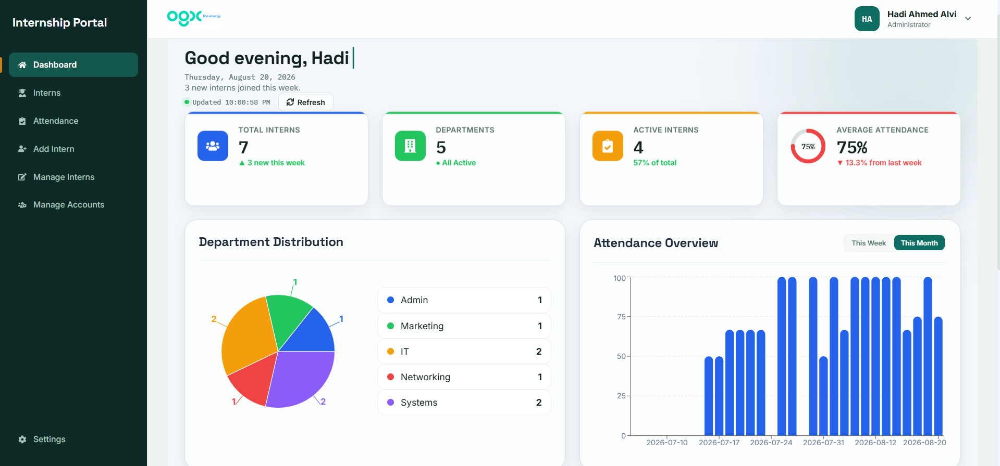
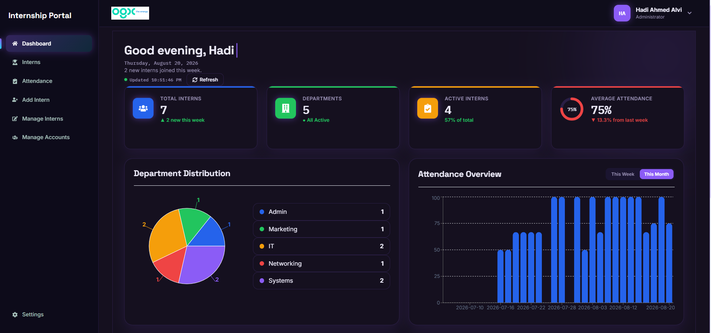
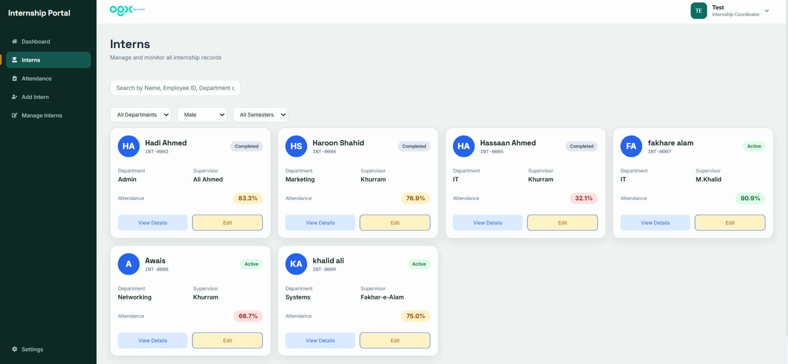
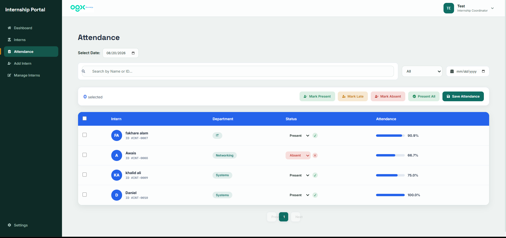
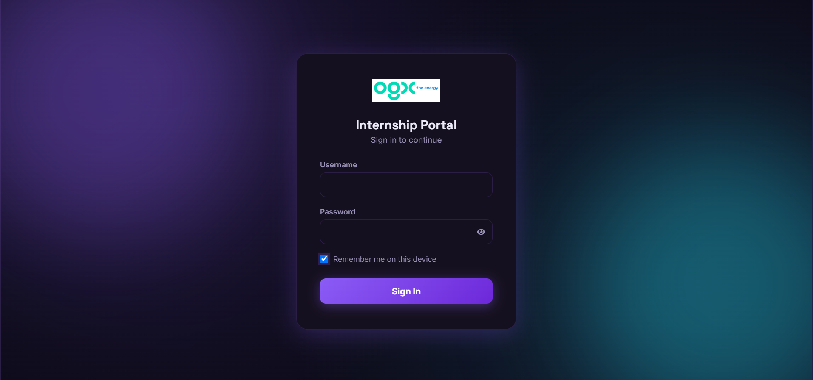
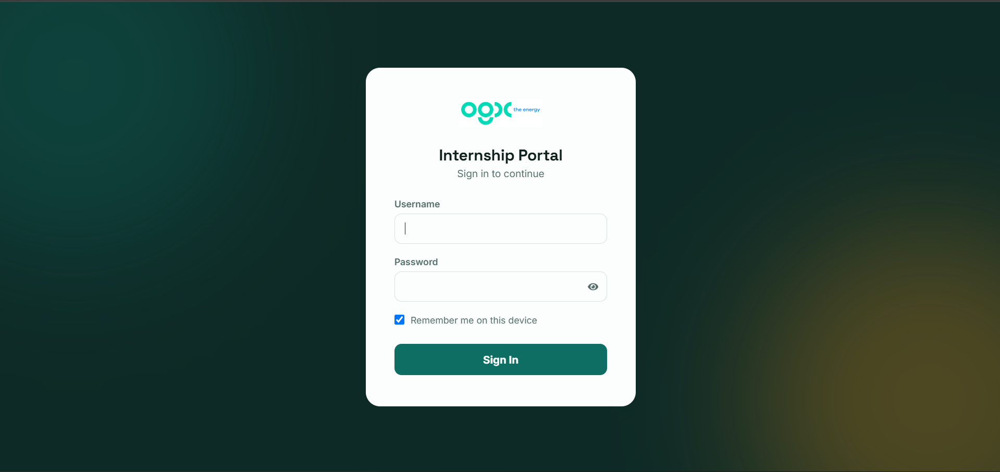

# Internship Management Portal

A full-stack internship management system built with React, Flask, and MySQL — developed during my internship at OGDCL.

## 📸 Screenshots

| Interns Page | Attendance |
|---|---|
|  |  |

| login-dark | login-default |
|---|---|
|  |  |

